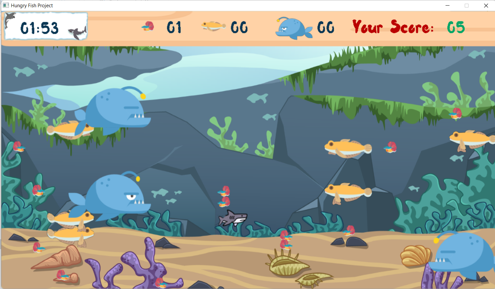

# ***Hungry-Fish***

## **Giới thiệu**

+ Họ và tên: Dương Nguyễn Việt Anh - K66CD - CN1 - UET - VNU

+ Mã sinh viên: 21020273

+ Bài tập lớn:  **Hungry Fish**  /INT2215 1 - Lập trình nâng cao

## **Mô tả dự án**

### *Mô tả game và hướng dẫn chơi*

- Ý tưởng xây dựng **Hungry Fish** bắt nguồn từ tựa game **Feeding Frenzy** kinh điển những năm 2010. 

- Có 3 loại cá xuất hiện trong game. Người chơi di chuyển chú cá mập ăn những loại cá nhỏ hơn nó, đồng thời cố gắng né tránh các mối đe dọa từ những loại cá lớn hơn. 

- Sau **2 phút** mà chú cá mập không bị ăn mất, bạn sẽ thắng. Ngược lại, bạn sẽ thua nếu bị ăn bởi loại cá to hơn.

- Mỗi loại cá có một số điểm tương ứng. Điểm của bạn sẽ được tính dựa trên chủng loại và số lượng cá ăn được:

     : 5 điểm         : 10 điểm              : 20 điểm


- Trò chơi có đủ tích hợp các chức năng hỗ trợ người chơi: hướng dẫn chơi chi tiết, bật/tắt âm thanh game, ghi nhận điểm cao, tạm dừng game khi đang chơi (esc key),...

- Video demo: 

### *Điều khiển trò chơi*

- Bạn di chuyển cá mập bằng chuột 

### *Preview*





## **Hướng dẫn cài đặt game**

### ***Đối tượng 1*** : **Chỉ có nhu cầu chơi game**

- Tải file rar theo đường link sau: https://drive.google.com/drive/folders/1QWWvFZcg2JDLI2CwGDsXPVNKGdPzs36d?usp=sharing

- Giải nén file vừa tải, mở folder *Release*, chạy file *Hungry Fish.exe* để bắt đầu chơi.

### ***Đối tượng 2*** : **Có nhu cầu tham khảo, sử dụng source code để phát triển thêm**

- Yêu cầu:

    1. Cài đặt CodeBlocks.

    2. Tải các thư viện hỗ trợ SDL: SDL2, SDL2_mixer, SDL2_image, SDL2_ttf.

    3. Hướng dẫn cài đặt thư viện SDL2 vào CodeBlocks: https://youtu.be/dC77R3MYjcU?list=PL-IbDGFpCvtluDVQSSslFYzFueSbjDvZO , làm tương tự đối với các thư viện còn lại.
    
- Cài đặt:

    1. Tải project về máy dưới dạng file ZIP hoặc dùng câu lệnh sau:
    ```
        git clone https://github.com/vanhsusu03/Hungry-Fish.git
    ```
    
    2. Add headers: Mở project bằng CodeBlocks, vào *Settings* -> *Complier* -> *Search directories* -> *Complier* -> *Add* -> lấy đường dẫn file *headers* trong folder project -> *OK* -> *OK*.

- Chạy chương trình: Click vào icon *Build and run* để chạy game.

- *Nếu gặp khó khăn trong quá trình cài đặt hay chơi game, hãy liên lạc qua email dnvietanhvnuuet@gmail.com.*

### *Các kỹ thuật sử dụng trong game*

- Thư viện SDL2.0

- Kĩ thuật tách file.

- Tạo, sử dụng và quản lí class nhiều đối tượng: cá, điểm ,hình ảnh, âm thanh,...

- Xử lí hình ảnh, thời gian, sự kiện SDL, bật/tắt âm thanh, di chuyển đối tượng, xử lí va chạm, tính toán tọa độ,....

### *Các nguồn tham khảo*

- Cách sử dụng, cài đặt SDL2, quản lí chương trình, tách file: https://www.youtube.com/channel/UC5BjUr9a3lHAe4a8Y8uuqLw , https://github.com/trongminh03 

- Hình ảnh:  https://www.flaticon.com/ - tất cả animations đều tự design.

- Âm thanh: Google, Feeding Frenzy 1, Feeding Frenzy 2.

## **Tổng kết**

### *Điều tâm đắc*

- Toàn bộ project là do bản thân em tự làm, không sao chép, tìm kiếm hay tham khảo từ bất kì nguồn nào.

- Cải thiện nhiều kĩ năng lập trình, sử dụng và quản lí file, chương trình.

- Học được cách design hình ảnh, sử dụng photoshop, edit âm thanh,..

### *Điểm hạn chế*

- Quản lí đối tượng chưa thật sự tối ưu.

### *Hướng phát triển tiếp theo*

- Phát triển thêm simple AI cho các loại cá trong game, biết né tránh đối tượng lớn hơn, đuổi theo đối tượng nhỏ hơn.

- Phát triển nhiều chế độ chơi từ dễ đến khó, tăng dần tốc độ, thêm threats,...

- Cập nhật bảng xếp hạng high scores, lấy top điểm cao.

- Cải thiện chất lượng hình ảnh trong game.


### *Mức điểm tự đánh giá* : 9 - 9,5 / 10 ###


